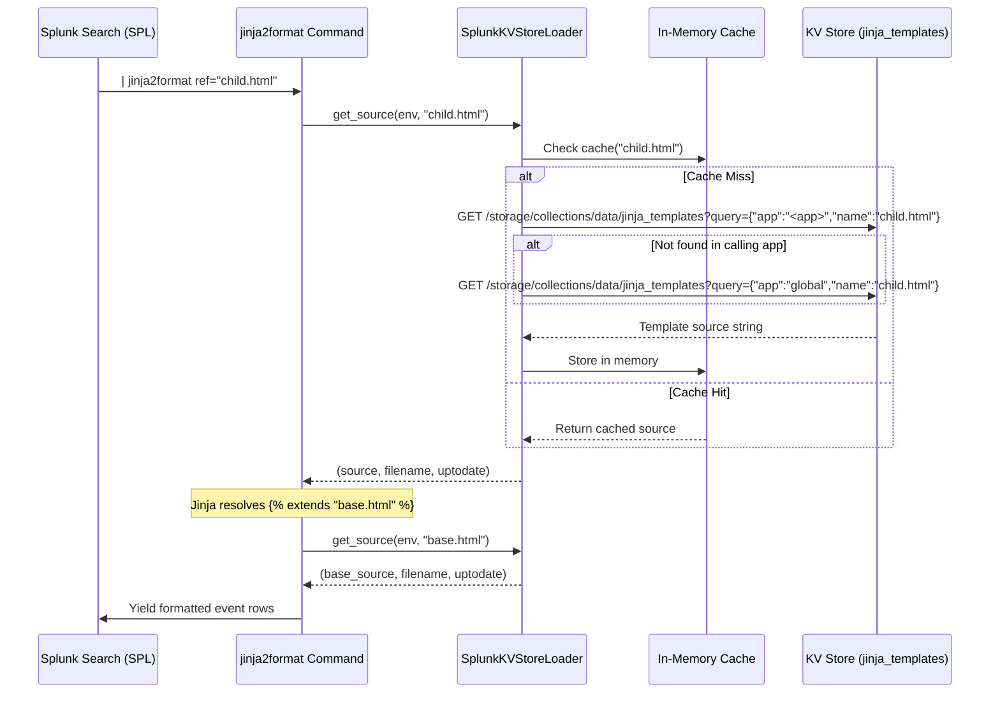

# Multi-Tenant Template Inheritance Guide

This guide provides an in-depth reference for designing, managing, and automating Jinja2 templates with **Splunk KV Store** backing and template inheritance in `jinja2format`.

---

## Table of Contents

1. [Architecture Overview](#architecture-overview)
2. [KV Store Schema & Configuration](#kv-store-schema--configuration)
3. [Resolution Logic & Multi-Tenancy](#resolution-logic--multi-tenancy)
   - [Scoped Resolution Hierarchy](#scoped-resolution-hierarchy)
   - [Cross-App Borrowing](#cross-app-borrowing)
4. [Design Patterns for Template Inheritance](#design-patterns-for-template-inheritance)
   - [Pattern 1: Base Layout & Blocks](#pattern-1-base-layout--blocks)
   - [Pattern 2: Shared Component Includes](#pattern-2-shared-component-includes)
   - [Pattern 3: Reusable Macro Libraries](#pattern-3-reusable-macro-libraries)
5. [Managing Templates via SPL](#managing-templates-via-spl)
   - [Insert or Update a Template](#insert-or-update-a-template)
   - [List Existing Templates](#list-existing-templates)
   - [Delete a Template](#delete-a-template)
6. [Managing Templates via Splunk REST API (CI/CD)](#managing-templates-via-splunk-rest-api-cicd)
   - [Insert / Update via curl](#insert--update-via-curl)
   - [Retrieve Template via curl](#retrieve-template-via-curl)
   - [Automated Git-to-KVStore Sync Script](#automated-git-to-kvstore-sync-script)
7. [Caching & Performance Architecture](#caching--performance-architecture)
8. [Security & Sandboxing](#security--sandboxing)

---

## Architecture Overview

When rendering templates with `ref="<name>"` or `@<name>`, `jinja2format` uses a custom Jinja2 loader, `SplunkKVStoreLoader`, connected to the Splunk search context's REST service:



---

## KV Store Schema & Configuration

The KV Store collection is defined in `default/collections.conf`:

```ini
[jinja_templates]
field.name = string
field.app = string
field.template = string
field.updated = time
accelerated_fields.app_name_idx = {"app": 1, "name": 1}
replicate = true
```

And mapped to a lookup in `default/transforms.conf`:

```ini
[jinja_templates_lookup]
collection = jinja_templates
external_type = kvstore
fields_list = _key, app, name, template, updated
```

Permissions in `metadata/default.meta` export the collection globally (`export = system`) so that any Splunk app can read shared templates.

---

## Resolution Logic & Multi-Tenancy

### Scoped Resolution Hierarchy

When an unqualified template name is referenced (e.g. `ref="alert.html"` or ``):

1. **Current App Context**:
   The loader determines the executing search app via the search context (`self.search_results_info.app`). It first queries:
   ```json
   {"app": "<calling_app>", "name": "<template_name>"}
   ```
2. **Global Fallback**:
   If no record matches and the calling app is not already `"global"`, the loader queries:
   ```json
   {"app": "global", "name": "<template_name>"}
   ```
3. **TemplateNotFound**:
   If no record matches in `"global"`, a `jinja2.TemplateNotFound` exception is raised.

This hierarchy allows organizations to provide baseline company-wide templates in `global`, while individual teams (e.g. `secops`, `noc`, `compliance`) can override specific templates within their own app context without impacting others.

### Cross-App Borrowing

To explicitly bypass the fallback hierarchy and reference a template belonging to another app:

```spl
| jinja2format ref="secops:threat_intel_report.html"
```

Or inside Jinja2:

```jinja


```

When `<app>:<template>` syntax is used, the loader queries **strictly** `{"app": "<app>", "name": "<template>"}`. If not found, it raises `TemplateNotFound` immediately without falling back to global.

---

## Design Patterns for Template Inheritance

### Pattern 1: Base Layout & Blocks

Define a layout with semantic blocks that individual searches customize:

#### Base Template: `email_base.html` (`app="global"`)
```html
<!DOCTYPE html>
<html>
<head>
  <style>
    body { font-family: -apple-system, BlinkMacSystemFont, 'Segoe UI', Roboto, sans-serif; color: #333; }
    .header { background: #002b49; color: white; padding: 16px 24px; }
    .body { padding: 24px; }
    .footer { font-size: 12px; color: #777; border-top: 1px solid #ddd; padding: 16px 24px; }
  </style>
</head>
<body>
  <div class="header">
    <h1>Splunk Notification</h1>
  </div>
  <div class="body">
    
    <p>No content provided.</p>
    
  </div>
  <div class="footer">
    
    This notification was automatically generated by Splunk Enterprise at {{ _time | strftime }}.
    
  </div>
</body>
</html>
```

#### Child Template: `ransomware_alert.html` (`app="secops"`)
```html


CRITICAL SECURITY ALERT: Ransomware Indicator Detected


<p>Host <strong>{{ host }}</strong> reported file modification patterns matching known ransomware behavior.</p>

<table border="1" cellpadding="6" cellspacing="0">
  <tr><th>Indicator</th><th>Value</th></tr>
  <tr><td>Detection Rule</td><td>{{ rule_name }}</td></tr>
  <tr><td>Process Name</td><td>{{ process_name }}</td></tr>
  <tr><td>File Count</td><td>{{ encrypted_files_count }}</td></tr>
</table>

<h3>Immediate Containment Steps</h3>
<ul>
  <li>Isolate endpoint <code>{{ host }}</code> from the corporate network.</li>
  <li>Revoke Active Directory credentials for user <code>{{ user }}</code>.</li>
</ul>

```

### Pattern 2: Shared Component Includes

Split complex templates into reusable fragments using ``:

#### Header Fragment: `nav_header.html` (`app="global"`)
```html
<div class="nav-bar">
  <span class="logo">ACME Corp Splunk Monitoring</span>
  <span class="env">Environment: <strong>{{ env | default('Production') }}</strong></span>
</div>
```

#### Main Template:
```html

<div class="main">
  <h2>Server Health Report for {{ host }}</h2>
  <p>Load average: {{ load_avg }}</p>
</div>
```

### Pattern 3: Reusable Macro Libraries

Create shared utility functions in Jinja templates and import them:

#### Macro Library: `table_helpers.j2` (`app="global"`)
```jinja

<table class="kv-table">
  
  <tr>
    <td class="key"><strong>{{ k }}</strong></td>
    <td class="val">{{ v }}</td>
  </tr>
  
</table>

```

#### Consumer Template:
```jinja


<h3>Event Metadata</h3>
{{ tables.render_kv_table(metadata_dict | fromjson) }}
```

---

## Managing Templates via SPL

Because `jinja_templates` is exposed as a lookup (`jinja_templates_lookup`), analysts and administrators can manage templates using familiar search commands:

### Insert or Update a Template

```spl
| makeresults 
| eval app="global", 
       name="slack_incident.json", 
       template="{\"text\": \"Incident {{ incident_id }}: {{ summary }}\"}", 
       updated=now() 
| outputlookup append=true jinja_templates_lookup
```

### List Existing Templates

```spl
| inputlookup jinja_templates_lookup 
| eval last_modified=strftime(updated, "%Y-%m-%d %H:%M:%S")
| table app, name, last_modified, template
| sort app, name
```

### Delete a Template

```spl
| inputlookup jinja_templates_lookup 
| search NOT (app="global" AND name="slack_incident.json") 
| outputlookup jinja_templates_lookup
```

---

## Managing Templates via Splunk REST API (CI/CD)

For production environments, templates can be version-controlled in Git and automatically synchronized into Splunk's KV Store using GitHub Actions, GitLab CI, or Jenkins.

### Insert / Update via curl

```bash
# Upload or overwrite a template in the jinja_templates KV Store
curl -k -u "admin:changed!" \
  -X POST "https://splunk.example.com:8089/servicesNS/nobody/jinja_formatter/storage/collections/data/jinja_templates" \
  -H "Content-Type: application/json" \
  -d '{
    "app": "global",
    "name": "incident_alert.html",
    "template": "{{ alert_msg }}",
    "updated": 1789593200
  }'
```

### Retrieve Template via curl

```bash
curl -k -u "admin:changed!" \
  -G "https://splunk.example.com:8089/servicesNS/nobody/jinja_formatter/storage/collections/data/jinja_templates" \
  --data-urlencode 'query={"app": "global", "name": "incident_alert.html"}'
```

### Automated Git-to-KVStore Sync Script

Save this script as `sync_templates.py` in your Git repository to synchronize a directory of template files into Splunk:

```python
#!/usr/bin/env python3
"""Sync local template directory to Splunk KV Store collection."""
import json
import os
import sys
import time
from pathlib import Path
import requests

SPLUNK_URL = os.getenv("SPLUNK_URL", "https://localhost:8089")
SPLUNK_USER = os.getenv("SPLUNK_USER", "admin")
SPLUNK_PASSWORD = os.getenv("SPLUNK_PASSWORD", "changed!")
TEMPLATES_DIR = Path("templates")

ENDPOINT = f"{SPLUNK_URL}/servicesNS/nobody/jinja_formatter/storage/collections/data/jinja_templates"

def sync_templates():
    session = requests.Session()
    session.auth = (SPLUNK_USER, SPLUNK_PASSWORD)
    session.verify = False  # Set to True or provide CA bundle in production

    for tpl_path in TEMPLATES_DIR.glob("**/*.*"):
        if tpl_path.is_file():
            # Folder structure determines app context: templates/<app>/<template_name>
            rel_parts = tpl_path.relative_to(TEMPLATES_DIR).parts
            app_scope = rel_parts[0] if len(rel_parts) > 1 else "global"
            template_name = rel_parts[-1]

            content = tpl_path.read_text(encoding="utf-8")
            payload = {
                "app": app_scope,
                "name": template_name,
                "template": content,
                "updated": int(time.time()),
            }

            # Check if template already exists
            query = json.dumps({"app": app_scope, "name": template_name})
            res = session.get(ENDPOINT, params={"query": query})
            items = res.json()

            if items:
                key = items[0]["_key"]
                session.post(f"{ENDPOINT}/{key}", json=payload)
                print(f"Updated: {app_scope}:{template_name}")
            else:
                session.post(ENDPOINT, json=payload)
                print(f"Created: {app_scope}:{template_name}")

if __name__ == "__main__":
    sync_templates()
```

---

## Caching & Performance Architecture

To maintain high throughput when formatting tens of thousands of search events per second:

1. **Loader Cache (`_cache`)**:
   `SplunkKVStoreLoader` maintains an in-memory dictionary during the lifetime of each search command execution. Each unique template reference (`app:name`) is requested from Splunkd's KV Store REST endpoint exactly once per search job.
2. **Jinja AST Compilation Cache**:
   Compiled template Abstract Syntax Trees (AST) are cached using Python's `@functools.lru_cache(maxsize=512)`. When streaming thousands of records using the same template, rendering is pure Python memory execution with zero parsing overhead.

---

## Security & Sandboxing

All template execution occurs inside a `jinja2.sandbox.SandboxedEnvironment`:
- Access to private attributes (`_`, `__class__`, `__globals__`, etc.) is strictly forbidden.
- Arbitrary code execution or system imports cannot be triggered from templates.
- File system access (`open()`, `os.system`) is impossible.
- Variable evaluations that exceed reasonable bounds can be controlled via the `on_error` parameter (`message`, `fail`, `null`).
