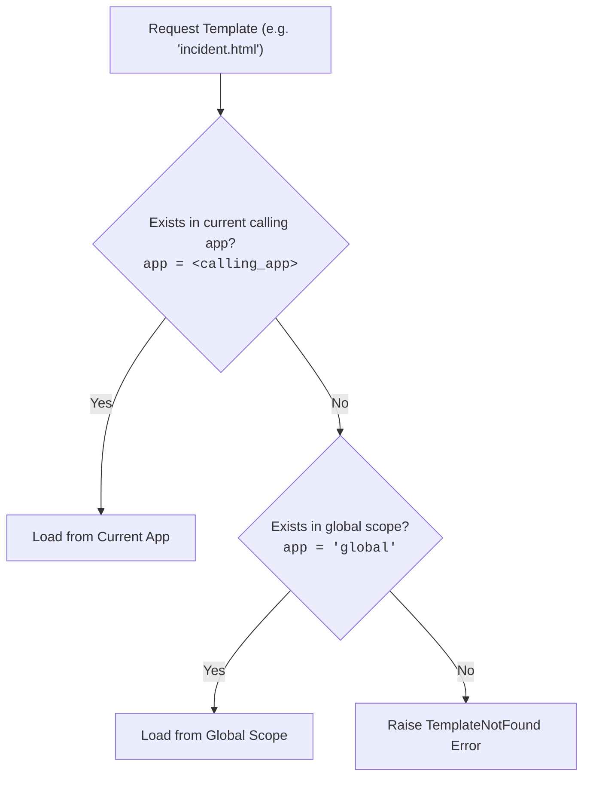

# Jinja2 Splunk Formatting Command (`jinja2format`)

A custom streaming search command for Splunk Enterprise and Splunk Cloud that formats search results using the **Jinja2 templating engine**. 

It supports **inline templates**, **dynamic event-field templates**, and **Splunk KV Store-backed templates** with multi-tenant template inheritance (``, ``, ``).

---

## Table of Contents

1. [Motivation](#motivation)
2. [Syntax & Options](#syntax--options)
3. [Template Specification Methods](#template-specification-methods)
   - [Method 1: Inline Template String](#method-1-inline-template-string)
   - [Method 2: Dynamic Template from an Event Field](#method-2-dynamic-template-from-an-event-field)
   - [Method 3: Stored KV Store Template via `ref=`](#method-3-stored-kv-store-template-via-ref)
   - [Method 4: Stored KV Store Template via `@` Prefix](#method-4-stored-kv-store-template-via--prefix)
   - [Summary Comparison](#summary-comparison)
4. [KV Store Templates & Inheritance](#kv-store-templates--inheritance)
   - [Why Store Templates in the KV Store?](#why-store-templates-in-the-kv-store)
   - [Multi-Tenant Resolution Hierarchy](#multi-tenant-resolution-hierarchy)
   - [Cross-App Borrowing](#cross-app-borrowing)
   - [Managing Templates with SPL (`jinja_templates_lookup`)](#managing-templates-with-spl-jinja_templates_lookup)
   - [End-to-End Inheritance Walkthrough](#end-to-end-inheritance-walkthrough)
5. [Built-in Custom Filters & Functions](#built-in-custom-filters--functions)
   - [Custom Filters](#custom-filters)
   - [Custom Global Functions](#custom-global-functions)
6. [Error Handling (`on_error`)](#error-handling-on_error)
7. [Best Practices & Tips](#best-practices--tips)
   - [Handling Quotes in SPL](#handling-quotes-in-spl)
   - [Multivalue Fields with `tolist`](#multivalue-fields-with-tolist)
   - [Performance & Caching](#performance--caching)
8. [Comprehensive Real-World Examples](#comprehensive-real-world-examples)
   - [Example 1: HTML Alert Email with Modular Branding](#example-1-html-alert-email-with-modular-branding)
   - [Example 2: Dynamic Per-Event Template Selection](#example-2-dynamic-per-event-template-selection)
   - [Example 3: Webhook / Slack JSON Payload Generation](#example-3-webhook--slack-json-payload-generation)
9. [Troubleshooting & FAQs](#troubleshooting--faqs)
10. [References & Links](#references--links)

---

## Motivation

In Splunk searches, formatting human-readable text (such as alert emails, Jira tickets, Slack webhooks, or dashboard markdown) traditionally requires long, brittle chains of `strcat`, `replace`, and `eval` string concatenations.

`jinja2format` replaces that boilerplate with Jinja2 templating:
- **Clean SPL**: Keep search pipelines focused on filtering, statistics, and correlation.
- **Reusable Templates**: Store complex layouts, corporate email themes, or incident notification formats in the KV Store.
- **Template Inheritance**: Define a single base layout with headers and footers, then allow specific searches to extend only the body blocks.
- **Powerful Logic**: Render conditional warnings, iterate through multivalue fields, calculate averages, and serialize JSON/YAML effortlessly.

---

## Syntax & Options

```spl
| jinja2format [ref=<template-name|field-name>] [result=<field-name>] [on_error=<message|fail|null>] [<template-string|template-field|@template-name>]
```

### Options Breakdown

| Option | Type | Default | Description |
|:---|:---|:---|:---|
| `ref` | string | *None* | **KV Store reference**: Name of a template stored in the `jinja_templates` KV Store collection (e.g. `ref="alert.html"` or cross-app `ref="secops:base.html"`), OR an event field name containing the template identifier. |
| `result` | string | `formatted_template` | Name of the output field in each event that will hold the rendered string. |
| `on_error` | string | `message` | Behavior on template syntax or rendering errors: <br>• `message`: Writes the formatted error message into the result field. <br>• `fail`: Aborts the search and displays an error. <br>• `null`: Leaves the result field null/empty on failure. |
| `<template>` | string | *None* | **Positional template argument**: <br>• An inline Jinja2 template string (e.g. `"Hello, {{ name }}!"`). <br>• An event field name holding an inline template (e.g. `template_field`). <br>• A KV Store reference prefixed with `@` (e.g. `@alert.html` or `@app:alert.html`). |

> [!IMPORTANT]
> **Mutual Exclusion**: You must specify either `ref` or a positional template argument. Specifying both (e.g. `| jinja2format "Hello" ref="base.html"`) raises a clear error:
> `Conflicting arguments specified. Specify either 'ref' or a positional template argument, not both.`

---

## Template Specification Methods

You can provide templates to `jinja2format` in four convenient ways:

### Method 1: Inline Template String
Best for quick, one-off formatting directly in your search query:

```spl
| makeresults 
| eval name="Alice", status="Resolved" 
| jinja2format "User {{ name }} has status: {{ status }}"
```

### Method 2: Dynamic Template from an Event Field
Best when the template string is generated dynamically or extracted from an indexed log:

```spl
| makeresults 
| eval name="Bob", my_template="Notification for {{ name }}" 
| jinja2format my_template
```

### Method 3: Stored KV Store Template via `ref=`
Best for shared, production-grade templates and template inheritance:

```spl
| makeresults 
| eval user="Charlie", host="web-prod-01", severity="HIGH" 
| jinja2format ref="security_alert.html"
```

You can also pass a field name to `ref` to dynamically choose different KV Store templates per row:

```spl
| makeresults 
| eval alert_type="firewall_block.html" 
| jinja2format ref=alert_type
```

### Method 4: Stored KV Store Template via `@` Prefix
A concise shorthand for referencing KV Store templates positionally or from fields:

```spl
| makeresults 
| eval user="Diana" 
| jinja2format @security_alert.html
```

Or via field:

```spl
| makeresults 
| eval template_ref="@security_alert.html" 
| jinja2format template_ref
```

### Summary Comparison

| Method | Syntax | Source | Supports Inheritance (``)? |
|:---|:---|:---|:---:|
| Inline string | `| jinja2format "Hello {{ user }}"` | Search query | No (standalone) |
| Field string | `| jinja2format template_field` | Event field | No (standalone) |
| KV Store option | `| jinja2format ref="alert.html"` | KV Store collection | **Yes** |
| KV Store option (dynamic field) | `| jinja2format ref=field_name` | KV Store collection | **Yes** |
| KV Store `@` shorthand | `| jinja2format @alert.html` | KV Store collection | **Yes** |
| KV Store `@` dynamic field | `| eval tpl="@alert.html" \| jinja2format tpl` | KV Store collection | **Yes** |

---

## KV Store Templates & Inheritance

### Why Store Templates in the KV Store?

Embedding large HTML email bodies or complex markdown reports directly in SPL queries leads to unwieldy searches that are difficult to review, edit, or version.

Storing templates in the `jinja_templates` KV Store provides:
1. **Separation of Concerns**: Analytics queries stay focused on data; presentation lives in templates.
2. **True Template Inheritance (``)**: Define global headers, styling, and disclaimers once. Alert templates only define their specific content blocks.
3. **No Splunk Restarts Required**: Create or edit templates dynamically with `outputlookup` or REST API; changes take effect immediately on subsequent searches.
4. **Multi-Tenancy & Isolation**: Apps can define app-specific templates that override global templates, or borrow shared templates across apps.

### Multi-Tenant Resolution Hierarchy

When a template is requested by name (e.g. `ref="incident.html"` or ``), `jinja2format` uses deterministic resolution:



1. **Scoped Search (Current App)**: Queries `jinja_templates` where `app = <calling_app>` and `name = <template_name>`.
2. **Global Fallback**: If not found in the calling app, queries `app = "global"` and `name = <template_name>`.
3. **TemplateNotFound**: If neither exists, a `jinja2.TemplateNotFound` error is raised.

### Cross-App Borrowing

To explicitly load a template from a specific Splunk app without relying on fallback, prefix the template name with `<app_name>:`:

```spl
| jinja2format ref="secops_app:incident_report.html"
```

Or inside an inherited template:

```jinja

```

Cross-app resolution queries strictly for `app = "enterprise_branding"` and `name = "corporate_base.html"`. If not found, it raises `TemplateNotFound` without falling back to global, preserving strict tenant boundaries.

### Managing Templates with SPL (`jinja_templates_lookup`)

The app includes a preconfigured KV Store collection `jinja_templates` and lookup `jinja_templates_lookup`. The collection schema contains:
- `name` (string): Unique identifier for the template (e.g., `base.html`, `slack_alert.j2`).
- `app` (string): Splunk app context (e.g., `search`, `secops`, or `global`).
- `template` (string): Raw Jinja2 template contents.
- `updated` (time): Epoch timestamp of last update.

#### Creating or Updating a Template

```spl
| makeresults 
| eval app="global", 
       name="email_base.html", 
       template="
<!DOCTYPE html>
<html>
<head><style>body { font-family: sans-serif; } .hdr { color: #003366; }</style></head>
<body>
  <div class='hdr'><h2>Security Alert System</h2></div>
  <hr/>
  <div class='content'></div>
  <hr/>
  <p><small>Confidential - Generated by Splunk at {{ _time | strftime }}</small></p>
</body>
</html>", 
       updated=now() 
| outputlookup append=true jinja_templates_lookup
```

#### Viewing Stored Templates

```spl
| inputlookup jinja_templates_lookup
| table app, name, updated, template
```

#### Deleting a Template

```spl
| inputlookup jinja_templates_lookup 
| search NOT (app="global" AND name="email_base.html") 
| outputlookup jinja_templates_lookup
```

### End-to-End Inheritance Walkthrough

Here is a complete walkthrough showing template inheritance in action:

#### Step 1: Save the Base Template
Save a base template defining the layout structure and placeholder blocks:

```spl
| makeresults 
| eval app="global", 
       name="base.html", 
       template="[START] Default content [END]", 
       updated=now() 
| outputlookup append=true jinja_templates_lookup
```

#### Step 2: Save the Child Template
Save a child template that extends `base.html` and overrides ``:

```spl
| makeresults 
| eval app="global", 
       name="alert.html", 
       template="Alert: {{ alert_type }} on host {{ host }}", 
       updated=now() 
| outputlookup append=true jinja_templates_lookup
```

#### Step 3: Render Using `jinja2format`
Execute your search and format results with `ref="alert.html"`:

```spl
| makeresults 
| eval alert_type="High CPU Usage", host="web-server-04" 
| jinja2format ref="alert.html"
```

**Output in `formatted_template`**:
```text
[START] Alert: High CPU Usage on host web-server-04 [END]
```

---

## Built-in Custom Filters & Functions

In addition to standard Jinja2 filters (e.g. `upper`, `lower`, `default`, `join`, `length`), `jinja2format` includes filters and functions tailored for Splunk data structures:

### Custom Filters

#### `strftime(unix_timestamp, format_string="%Y-%m-%dT%H:%M:%S%z")`
Converts a Unix epoch timestamp (such as `_time`) into a formatted date/time string.
```jinja
{{ _time | strftime('%Y-%m-%d %H:%M:%S') }}
```

#### `fromjson(value)`
Parses a JSON string into a Python dictionary or list structure.
```jinja

Host: {{ obj.system.hostname }}
```

#### `toyaml(value)`
Serializes an object or dictionary into clean, formatted YAML.
```jinja
{{ event_details | fromjson | toyaml }}
```

#### `tolist(value)`
Converts the value into a Python list. **Crucial for Splunk fields**, which may be either a string (single value) or a list (multivalue). `tolist` guarantees safe iteration in `` loops:
```jinja

  - IP: {{ ip }}

```

#### `b64encode(value)`
Encodes a string to standard Base64.
```jinja
{{ credentials | b64encode }}
```

#### `b64decode(value)`
Decodes a standard Base64 string into UTF-8 text.
```jinja
{{ encoded_payload | b64decode }}
```

#### `avg(list_values)`
Computes the arithmetic average of a list or iterable of numbers:
```jinja
Average latency: {{ [response_time, 120, 150] | avg | round(2) }} ms
```

---

### Custom Global Functions

#### `zip(list1, list2, ...)`
Pairs elements across multiple lists until the shortest list is exhausted:
```jinja

  * {{ user }} ({{ role }})

```

#### `zip_longest(list1, list2, ..., fillvalue=None)`
Pairs elements across multiple lists until the longest list is exhausted, filling missing elements with `fillvalue`:
```jinja

  * {{ host }} -> {{ ip }}

```

#### `enumerate(iterable, start=0)`
Yields pairs of `(index, item)` starting from `start` (default 0):
```jinja

  {{ idx }}. {{ item }}

```

---

## Error Handling (`on_error`)

Templates may contain typos, invalid filter calls, or divide-by-zero errors. The `on_error` option allows you to dictate how search processing reacts:

| Mode | Behavior | SPL Example | Result Field Content |
|:---|:---|:---|:---|
| `on_error=message` *(default)* | Emits an informative error string into the result field; search continues. | `\| jinja2format on_error=message broken_tpl` | `Jinja2 Rendering Error: division by zero` |
| `on_error=null` | Leaves the result field blank/null; search continues cleanly. | `\| jinja2format on_error=null broken_tpl` | `null` |
| `on_error=fail` | Terminates the Splunk search immediately with a fatal error. | `\| jinja2format on_error=fail broken_tpl` | *Search aborts* |

---

## Best Practices & Tips

### Handling Quotes in SPL

In Splunk SPL, double-quotes (`"`) are used for string literals. When defining inline templates:

1. **Use Single Quotes Inside Jinja**:
   Inside `{{ ... }}` expressions, use single quotes (`'...'`). They do not conflict with SPL double quotes and require zero backslashes:
   ```spl
   | eval template="Today is {{ _time | strftime('%Y-%m-%d') }}"
   | jinja2format template
   ```

2. **Prefer KV Store Templates for Complex Layouts**:
   Store HTML, Markdown, or multi-line text in the KV Store using `ref="template.html"`. This eliminates SPL quote escaping issues entirely.

3. **Construct Dictionaries with Single Quotes for `tojson` / `toyaml`**:
   Avoid manual JSON quoting like `"{\"user\": \"" . user . "\"}"`. Instead, construct the dictionary inside Jinja:
   ```spl
   | jinja2format "{{ {'user': user, 'status': status, 'active': true} | tojson }}"
   ```

### Multivalue Fields with `tolist`

When Splunk passes fields to custom search commands:
- A field with one value arrives as a primitive string (e.g. `"host-01.internal"`).
- A field with multiple values arrives as a list (e.g. `["host-01.internal", "host-02.internal"]`).

Always pipe potentially multi-value fields through `| tolist` before iterating:
```jinja

  - {{ item }}

```

### Performance & Caching

- **In-Memory Loader Cache**: When using KV Store templates (`ref=` or `@`), the `SplunkKVStoreLoader` fetches the template from the KV Store once per search and caches it in memory. Searches processing tens of thousands of rows only issue a single KV Store REST request per template.
- **Compiled AST Cache**: Inline and stored templates are compiled into Jinja ASTs and cached via an LRU cache (`maxsize=512`), minimizing CPU overhead during streaming.

---

## Comprehensive Real-World Examples

### Example 1: HTML Alert Email with Modular Branding

#### Base Layout (`email_brand_base.html` in KV Store):
```html
<!DOCTYPE html>
<html>
<head>
  <style>
    body { font-family: 'Segoe UI', Arial, sans-serif; background: #f4f6f8; margin: 0; padding: 20px; }
    .container { background: #ffffff; border-radius: 6px; padding: 24px; border: 1px solid #dcdfe6; }
    .header { border-bottom: 2px solid #0052cc; padding-bottom: 12px; margin-bottom: 16px; }
    .severity-high { color: #d32f2f; font-weight: bold; }
    .footer { font-size: 11px; color: #888888; margin-top: 24px; border-top: 1px solid #eeeeee; padding-top: 12px; }
  </style>
</head>
<body>
  <div class="container">
    <div class="header">
      <h2>SOC Alert Notification</h2>
    </div>
    <div class="content">
      
    </div>
    <div class="footer">
      Generated automatically by Splunk Jinja Formatter at {{ _time | strftime('%Y-%m-%d %H:%M:%S UTC') }}.
    </div>
  </div>
</body>
</html>
```

#### Incident Alert Template (`incident_email.html` in KV Store):
```html


Security Alert: {{ alert_name }}


<p>An event matching rule <strong>{{ rule_id }}</strong> was detected.</p>
<table>
  <tr><td><strong>Host:</strong></td><td>{{ dest_host }}</td></tr>
  <tr><td><strong>User:</strong></td><td>{{ src_user }}</td></tr>
  <tr><td><strong>Severity:</strong></td><td><span class="severity-high">{{ severity | upper }}</span></td></tr>
</table>

<h4>Impacted IP Addresses:</h4>
<ul>

  <li>{{ ip }}</li>

</ul>

```

#### Search Query:
```spl
index=alerts severity=high
| stats values(src_ip) as impacted_ips by alert_name, rule_id, dest_host, src_user, severity
| jinja2format ref="incident_email.html" result=email_html
| table alert_name, dest_host, email_html
```

---

### Example 2: Dynamic Per-Event Template Selection

Use event values to decide which template to render per row:

```spl
index=network_events
| eval alert_template = case(
    action == "blocked", "@network_block_summary.md",
    action == "allowed" AND bytes > 10000000, "@high_volume_transfer.md",
    1 == 1, "@default_audit.md"
  )
| jinja2format alert_template result=rendered_markdown
```

---

### Example 3: Webhook / Slack JSON Payload Generation

Construct rich JSON payload messages for external APIs without complicated escaping:

```spl
| makeresults 
| eval channel="#soc-alerts", 
       title="Brute Force Attempt Detected", 
       src="source-host-bad", 
       attempts=142
| eval template="
{{ {
  'channel': channel,
  'username': 'Splunk AlertBot',
  'icon_emoji': ':warning:',
  'attachments': [{
    'title': title,
    'color': 'danger',
    'fields': [
      {'title': 'Source IP', 'value': src, 'short': true},
      {'title': 'Failed Attempts', 'value': attempts, 'short': true}
    ],
    'footer': 'Splunk Enterprise',
    'ts': _time
  }]
} | tojson(2) }}
"
| jinja2format result=slack_payload template
```

---

## Troubleshooting & FAQs

### Q: Why do I get `ValueError: Conflicting arguments specified`?
**A:** You passed both `ref=` and a positional template argument (e.g. `| jinja2format "Hello" ref="base.html"`). Choose either `ref="<template>"` or a positional argument (`"<template>"`, `<field>`, or `@<template>`).

### Q: Why do I get `jinja2.exceptions.TemplateNotFound: my_template.html`?
**A:** 
1. Check that the template exists in the lookup:
   ```spl
   | inputlookup jinja_templates_lookup | search name="my_template.html"
   ```
2. Check the `app` field in the lookup. If you are searching in the `search` app, the template must have `app="search"` or `app="global"`.
3. If the template belongs to another app (e.g. `secops`), reference it with `ref="secops:my_template.html"`.

### Q: Can I use `` and ``?
**A:** Yes! The `SplunkKVStoreLoader` resolves all Jinja template tags, including ``, ``, and ``, using the same multi-tenant hierarchy.

### Q: Are filesystem access or Python built-ins allowed in templates?
**A:** No. All templates run within a `jinja2.sandbox.SandboxedEnvironment`. Attempts to access private attributes (e.g. `__class__`, `__subclasses__`) or execute system commands are blocked by Jinja's security sandbox.

---

## References & Links

- [Jinja2 Template Designer Documentation](https://jinja.palletsprojects.com/en/latest/templates/)
- [Splunk Custom Search Commands V2 Documentation](https://docs.splunk.com/Documentation/Splunk/latest/Search/Aboutcustomsearchcommands)
- [Splunk KV Store Overview](https://docs.splunk.com/Documentation/Splunk/latest/Admin/AboutKVstore)
- [GitHub Repository & Issue Tracker](https://github.com/valorcz/splunk_jinja_formatter)
